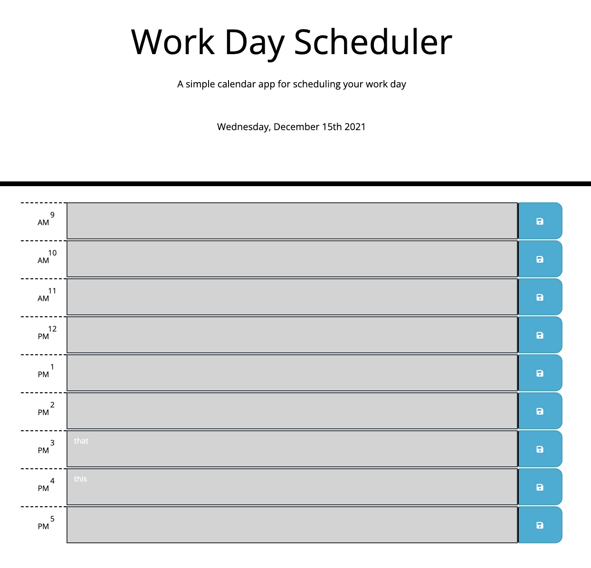

# Work Day Scheduler

## Table of Contents
* [About the Project](#abouttheproject)
    * [Key Features](#keyfeatures)
    * [Built With](#builtwith)
* [Links](#links)
* [Contact](#contact)
* [Acknowledgements](#acknowledgements)

## About the Project
A calendar web app to keep track of tasks and events happening that day.

### Key Features
* Work day is separated into hour blocks based on typical working hours.
* Hour blocks are color coded to indicate whether it is in the past, present, or future.
* Saved tasks are persistent, using local storage, so you can easily close and reload page whenever (on the same browser), without losing that day's tasks.
* Schedule resets to blank tasks each day, so you can start fresh every morning!

### Built With
* [jQuery](https://jquery.com/)
* [Moment.js](https://momentjs.com/docs/)
* [Bootstrap](https://getbootstrap.com/)

## Links
You can check out the deployed site [here]().

You can view my code and download the repo [here]().

## Contact
Written and deployed by Lelah Bates Childs.

You can find me on GitHub [@labchild](https://github.com/labchild) or [email me](labchilds@gmail.com).

### Want to Help?
Do you see something I missed or a more succint and effective way this code can be written? Great! Please reach out and let me know how I can improve. Thanks in advance for your tips, tricks, and pointers!

## Acknowledgements ❣️
Thank you to my bootcamp instructional team and cohort, for helping me along this journey to become a developer.